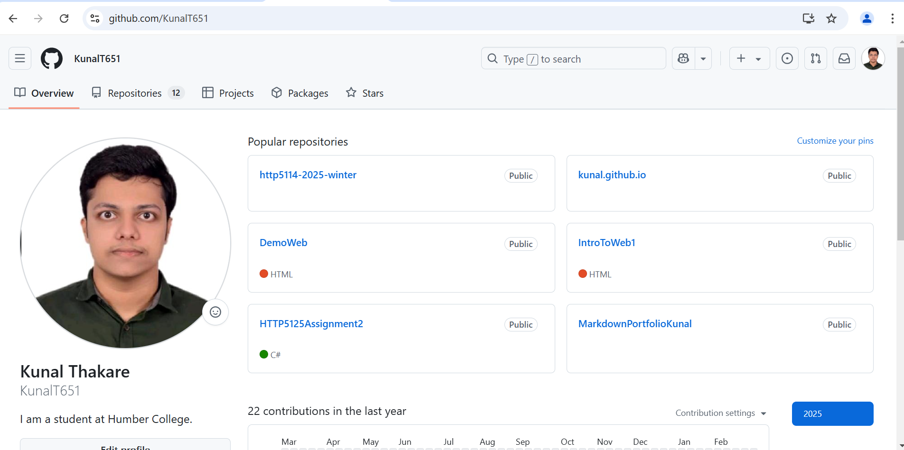

# Repository Name

This repository has my work for course Workshops in web development.

## Links
Visit My Github to find this repository: https://github.com/KunalT651

## Image Preview


## Information
> **Note:** You can use this repo to learn Web development. This repo contains my assignments. And the syllabus is according to Humbers curriculumn.

## Warning
> **Warning:** Do not copy my content. Dont put yourself and me in trouble!!!

## Code Sample
```javascrit
function DoSomething
{
    consol.log("Its Done!");
}
